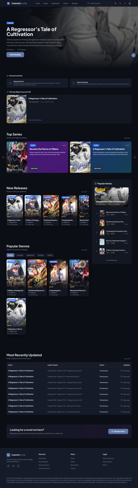

---

# 📚 Celestial Scrolls – Immortal Library

**Celestial Scrolls** is a modern web platform dedicated to delivering an immersive reading experience for Celestial, Xianxia, and Fantasy novels. Built with the latest web technologies, the platform offers an elegant, fast, and fully responsive interface.

---

## 📸 Preview


## 🚀 Live Demo

👉 **Try it here:** [https://calestial-scroll.vercel.app/](https://calestial-scroll.vercel.app/)
Deployed on **Vercel**

## 🌟 Key Features

### 📖 For Readers

* **Immersive Reading Experience** – A distraction-free reading mode with full customization:

  * **Font Type**: Choose between Serif and Sans-serif
  * **Text Size**: Adjustable for eye comfort
  * **Reader Theme**: Light, Sepia, and Dark modes available
  * **Visual Progress**: Indicators for read chapters to track your journey
  * **Tap to Toggle Controls**: Tap/click to show/hide navigation bar for a clean reading view

* **Complete Novel Catalog**

  * Advanced search and filtering capabilities
  * Interactive Genre cards with 3D hover effects
  * Sorting options (Most Popular, Latest, Top Rated)
  * **Dedicated Genres Page**: Browse novels by specific genre categories

* **📊 Rankings Page**

  * View novels ranked by popularity, rating, and views
  * Chapter count and detailed statistics per novel

* **Smart Library & Tracking**

  * **Recently Read**: Quick access to your last read book on the homepage
  * **Bookmarks**: Save your favorite series with sorting options (Time Added, Rating, Latest Chapter)
  * **History**: Comprehensive reading history
  * **Engagement**: Novel rating system and real-time view counters

* **🎖️ Cultivation Badge System (Gamification)**

  * Earn badges based on chapters read – 11 tier progression from **Martial Apprentice** to **Martial God**
  * Each badge has unique visual styling with gradients, glows, and animations
  * **Badge List Modal**: View all badge tiers, your current realm, and progression
  * Rainbow glow effect for the highest **Martial God** tier

* **👤 User Profiles & Settings**

  * **User Profile Modal**: Click on any user to view their public profile (avatar, bio, role badge, cultivation badge, join date)
  * **Profile Settings**: Update username, bio, and avatar (via image upload with UploadThing)
  * **Security Settings**: Change password with current password verification
  * **Role Badges**: Users are displayed with role badges – Mortal (User), Immortal (Moderator), Immortal King (Admin)

* **💬 Advanced Comment System**

  * **Threaded Replies**: Reply to comments with nested threads
  * **Upvote / Downvote**: Vote on comments to surface the best discussions
  * **Edit & Delete**: Edit your own comments or delete them
  * **Report Comments**: Report inappropriate comments with a reason
  * **Pagination**: Load more comments for threads with many responses

* **🚩 Report System**

  * **Report Chapters**: Report chapters with issues (translation errors, missing content, etc.)
  * **Report Comments**: Flag inappropriate comments for admin review
  * **Status Tracking**: Reports are tracked with pending/resolved/ignored statuses

* **📝 Request Novel**

  * Dedicated page for readers to request new novels via the comment system
  * DMCA guidelines displayed to inform users of content restrictions

* **🌐 Multi-Language Content Support**

  * **Language Filter**: Switch between 🇮🇩 **Indonesian** and 🇺🇸 **English** chapter content from the navbar
  * **Persistent Preference**: Selected language is saved to `localStorage` and applied across sessions
  * **Separate Chapter Counts**: Novel detail pages display distinct chapter counts per language
  * **Language-Aware Chapter List**: Tabs to browse Indonesian or English chapters independently

* **🔔 Real-Time Notification System**

  * **Bell Icon with Unread Badge**: Red dot indicator for unread notifications in the navbar
  * **Notification Types**: Receive alerts for comment replies, comment likes, system messages, and report status updates
  * **Admin Notifications**: Admins and moderators receive instant alerts when a new chapter or comment report is submitted
  * **Report Reply Dialog**: When an admin replies to your report, a dedicated dialog shows the admin's message
  * **Mark as Read / Mark All Read**: Mark individual or all notifications as read with a single click
  * **Real-time Subscription**: Powered by Supabase Realtime for instant push notifications without page refresh

* **User Interaction**

  * **Authentication**: Seamless login via **Google** or Email
  * **Forgot / Reset Password**: Full password recovery flow via email
  * **Community**: Comment system on novels and chapters for discussions

* **🏠 Dynamic Homepage**

  * **Hero Carousel**: Featured novels with randomized selection, cover backgrounds, and atmospheric blur effects
  * **Announcements Section**: Real-time announcements from admin displayed on the homepage
  * **Top Series Carousel**: Highest-rated series showcased in visually rich cards with gradient overlays
  * **New Releases & Recent Updates**: Latest content sections for staying up to date
  * **Popular Section**: Most popular novels based on view count

* **🎨 UI / UX Enhancements**

  * **Dark / Light / System Theme Toggle**: Site-wide theme switching with radio-style active state indicator and persistence
  * **Floating Dock Navigation**: Mobile-optimized bottom navigation dock for quick access
  * **Follow Cursor Effect**: Custom interactive cursor on desktop for an immersive feel
  * **Scroll-to-Top Button**: Quick navigation back to the top of long pages
  * **Smooth Animations**: Fade-in animations and hover effects throughout the platform

* **Progressive Web App (PWA)**

  * **Installable**: Functions as a native app on Mobile and Desktop
  * **Offline Capable**: Improved performance and caching

---

### 🛡️ Admin Dashboard

* **Advanced Analytics**

  * Real-time stats for Novels, Chapters, Users, and Views
  * **Weekly Trends**: Interactive bar charts visualizing viewership data over the past 7 days
  * **Popular Novels**: Quick view of the most popular novels with cover images and ratings

* **📚 Novel Management**

  * Full CRUD for novels (Create, Read, Update, Delete)
  * Markdown-based content editor for novel descriptions
  * **Image Upload**: Upload novel cover images via UploadThing integration
  * **Chapter Management**: Add, edit, and delete chapters per novel with rich text (Markdown) editor
  * **Server-side Pagination**: Efficient browsing of large datasets
  * **Language-Tagged Chapters**: Chapters are tagged with Indonesian (`id`) or English (`en`) language to support bilingual content

* **� EPUB Importer**

  * **Bulk Import**: Upload `.epub` files to automatically extract and import multiple chapters at once
  * **Smart Parsing**: Reads the EPUB's OPF manifest and spine to correctly order and extract chapter content
  * **Selective Import**: Preview extracted chapters with a checkbox list — select or deselect individual chapters before saving
  * **Language Selection**: Choose whether the imported chapters are in Indonesian or English before importing
  * **Auto Chapter Numbering**: Imported chapters are numbered sequentially based on existing chapters in the database

* **✍️ Smart Chapter Editor**

  * **Live Markdown Preview**: Toggle between write and preview tabs to see rendered chapter content in real time
  * **Auto Title Detection**: When pasting chapter content that begins with a pattern like `Chapter 5: Title Name`, the editor automatically fills in the chapter number and title fields
  * **Inline Image Upload**: Upload images directly from the chapter editor using UploadThing — the Markdown image tag is automatically appended to content
  * **Previous / Next Navigation**: When editing a chapter, use arrow buttons to navigate directly to the previous or next chapter without returning to the list
  * **Publish Toggle**: Switch chapter visibility between published and draft state

* **�👥 User Management**

  * View all registered users with search and pagination
  * **Role Management**: Change user roles between Admin, Moderator, and User
  * **Delete Users**: Remove user accounts with confirmation dialog
  * Role badge display (admin/moderator/user) for quick identification

* **🏷️ Genre Management**

  * Full CRUD for genres (Create, Read, Update, Delete)
  * Auto-generated slugs from genre names
  * Search functionality within genre list

* **📢 Announcements Management**

  * Create, edit, and delete site-wide announcements
  * **Toggle Active/Inactive**: Control which announcements are visible on the homepage
  * Rich content support with title and description

* **🚩 Reports Management**

  * **Comment Reports**: Review reported comments, view reporter info, update status (pending/resolved/ignored), and delete reports
  * **Chapter Reports**: Review reported chapters with links to the problematic content, update status, and manage reports
  * **Admin Reply**: Reply directly to the reporter — they receive a notification with the admin's message
  * Status badge system for quick visual identification

* **📋 Activity Log**

  * View recent comment activity across all novels and chapters
  * User info, timestamps, and direct links to the relevant content

* **🛡️ Admin Audit Log**

  * **Full Audit Trail**: Every admin and moderator action (CREATE, UPDATE, DELETE, BAN) is logged automatically
  * **Action Details**: Each log entry records the action type, target entity (Novel, Chapter, User, Comment), details, and timestamp
  * **Admin Identity**: Logs show which admin or moderator performed the action with their avatar and username
  * Built on the `admin_logs` table with automatic logging via the `adminLogger` service

* **Moderation & Management**

  * **Content Control**: Manage rankings and popular series list

---

## 🛠️ Tech Stack

This project is built using modern technologies for performance and scalability:

### Frontend

* **React** + **Vite** – Lightning-fast UI performance
* **TypeScript** – Type safety and robust development

### Styling & UI

* **Tailwind CSS** – Utility-first styling
* **shadcn/ui** – Accessible and beautiful UI components
* **Lucide** & **Tabler Icons** – Lightweight vector icons

### Backend & Infrastructure

* **Supabase** – PostgreSQL database, authentication, and realtime subscriptions
* **UploadThing** – Image upload service for avatars and novel covers

### Other Tools

* **TanStack Query** – Efficient server state management
* **React Router** – SPA navigation
* **Recharts** – Dashboard data visualization
* **React Markdown** + **remark-gfm** – Markdown rendering with GitHub-Flavored Markdown support
* **JSZip** – Client-side EPUB parsing and ZIP file extraction
* **date-fns** – Date formatting and manipulation
* **Vercel Analytics** – Website analytics and performance monitoring

---

## 🚀 Installation & Setup Guide

Follow these steps to run the project locally:

### Prerequisites

Make sure you have installed:

* **Node.js** (v18+ recommended)
* A package manager such as `npm`, `yarn`, or `bun`

---

### Steps

### 1. Clone the Repository

```bash
git clone https://github.com/adityaimamz/Calestial-scrolls.git
cd Calestial-scrolls
```

### 2. Install Dependencies

```bash
npm install
# or
bun install
```

### 3. Configure Environment Variables

Duplicate `.env.example`:

```bash
cp .env.example .env
```

Fill in your Supabase credentials:

```env
VITE_SUPABASE_URL=your_supabase_project_url
VITE_SUPABASE_ANON_KEY=your_supabase_anon_key
```

> **Note:** Create a project in the Supabase dashboard to obtain your URL and API key.

---

### 4. Start Development Server

```bash
npm run dev
```

Open:

```
http://localhost:5173
```

---

### 5. Build for Production

```bash
npm run build
```

The production build will be generated inside the `dist` folder.

---

## 📂 Main Folder Structure

```
src/
├── assets/         # Static assets (images, banners, novel covers)
├── components/     # Reusable UI components
│   ├── admin/      # Admin-specific components (StatsCard, etc.)
│   ├── auth/       # Auth components (AuthProvider, AdminRoute, etc.)
│   ├── layout/     # Layout components (MainLayout, AdminLayout)
│   ├── settings/   # Settings page components (Profile, Security)
│   └── ui/         # Base UI components (shadcn/ui, BarLoader, FloatingDock, etc.)
├── contexts/       # React Context providers
│   └── LanguageContext.tsx  # Multi-language filter context with localStorage persistence
├── hooks/          # Custom React Hooks (use-mobile, use-toast, useScrollHideNav)
├── i18n/           # Internationalization
│   └── translations.ts     # Translation strings for Indonesian & English UI
├── integrations/   # Third-party service configuration (Supabase client & types)
├── lib/            # Utilities and helper functions (badgeSystem, etc.)
├── pages/          # Application pages
│   ├── admin/      # Admin pages (Dashboard, NovelList, UserList, Reports, AdminLogs, etc.)
│   └── auth/       # Auth pages (Login, Register, ForgotPassword, etc.)
├── services/       # Business logic services
│   └── adminLogger.ts      # Utility to log admin/moderator actions to the audit trail
├── utils/          # Utility functions (UploadThing config)
└── index.css       # Global styles & design tokens
```

---

## 👨‍💻 Credits

Created and developed by **Aditya Imam Zuhdi**

* Instagram: @adityaimamz
* LinkedIn: Aditya Imam Zuhdi

---

